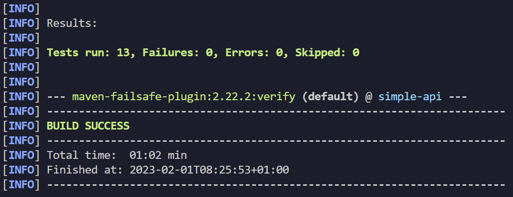
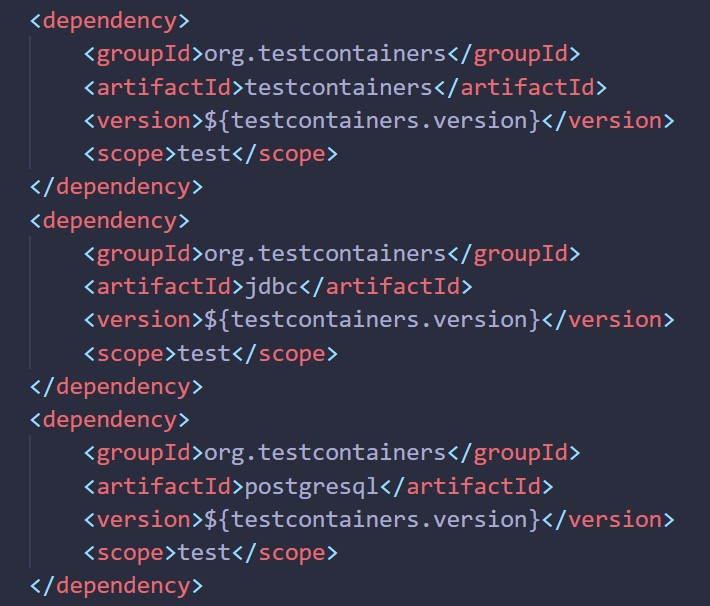

# TP2 : Découverte Github Actions

> Note : What is it supposed to do?

En lançant la commande `mvn clean verify`, nous rechargeons et installons toutes les dépendances décrites dans le `pom.xml`. En suite, les tests unitaires s'éxecutent un à un et la commande indique les réussites / échecs.



> Note : Unit tests? Component tests?

Les Tests Unitaires sont des tests qui visent à vérifier le comportement d'une méthode ou d'une fonction. Ils sont généralement réalisé pour tester le développement d'une fonctionnalité et pour débugger et en gage de qualité de code.

Les Tests de Composants sont des tests qui visent à vérifier le comportement d'une partie entière de l'application : classe ou module. Ces tests peuvent contenir différents Tests unitaires, car ils sont plus haut niveau. Ils sont généralement réalisé dans le cadre d'une modification de fonctionnalité sur l'applicatif pour éviter tout effet de bord et toutes régressions de l'application.


## 2-1 What are testcontainers ?

`Testcontainers` est une librairie java utilisée pour réalisé des tests sur une application : notamment des JUnit Tests. Elle permet la création d'une base de données directement lancée depuis un container avec un script donné (`ressources/InsertData.sql`) ce qui permet de simulée parfaitement la communication avec un module de base de données.

Voici toutes les dépendances utilisées pour la librairie `testcontainers` listées dans le `pom.xml`


## 2-2 Document your Github Actions configurations.

### Premiere version (1 job)
```yml
name: CI devops 2023
on:
  #to begin you want to launch this job in main and develop
  push:
    branches:
     - TP2
  pull_request:

jobs:
  test-backend: 
   runs-on: ubuntu-22.04
   steps:
    #checkout your github code using actions/checkout@v2.5.0
    - uses: actions/checkout@v2.5.0

    #do the same with another action (actions/setup-java@v3) that enable to setup jdk 17
    - name: Set up JDK 17
      uses: actions/setup-java@v3
      with:
        java-version: 17
        distribution: corretto

    #finally build your app with the latest command
    - name: Build and test with Maven
      # Localisation du pom.xml
      run: mvn clean verify --file api/pom.xml

```

### 2eme version (2jobs / 2wf)

```yaml
name: CI
on:
  #to begin you want to launch this job in main and develop
  push:
    branches:
     - TP2
     - main
  pull_request:

jobs:
  test-backend: 
   runs-on: ubuntu-22.04
   steps:
    #checkout your github code using actions/checkout@v2.5.0
    - uses: actions/checkout@v2.5.0

    #do the same with another action (actions/setup-java@v3) that enable to setup jdk 17
    - name: Set up JDK 17
      uses: actions/setup-java@v3
      with:
        java-version: 17
        distribution: corretto

    #finally build your app with the latest command
    - name: Build and test with Maven
      #run: mvn clean verify --file api/pom.xml
      run : mvn -B verify sonar:sonar -Dsonar.projectKey=MaximeBattu_DevOps -Dsonar.organization=maximebattu -Dsonar.host.url=https://sonarcloud.io -Dsonar.login=${{ secrets.SONAR_TOKEN }} --file ./api/pom.xml
```

```yaml
name: CD
on:
  #to begin you want to launch this job in main and develop
  workflow_run:
    workflows:
     - CI
    types:
     - completed
    branches:
     - main
  pull_request:

jobs:
  # define job to build and publish docker image
  build-and-push-docker-image:
   # run only when code is compiling and tests are passing
   runs-on: ubuntu-22.04

   # steps to perform in job
   steps:
    - name: Checkout code
      uses: actions/checkout@v2.5.0

    - name: Login to DockerHub
      run: docker login -u ${{ secrets.DOCKERHUB_USR }} -p ${{ secrets.DOCKERHUB_TOKEN }}

    - name: Build image and push backend
      uses: docker/build-push-action@v3
      with:
        # relative path to the place where source code with Dockerfile is located
        context: ./api/
        # Note: tags has to be all lower-case
        tags:  ${{secrets.DOCKERHUB_USR}}/docker-api:latest
        # build on feature branches, push only on main branch
        push: ${{ github.ref == 'refs/heads/main' }}

    - name: Build image and push database
      uses: docker/build-push-action@v3
      with:
        # relative path to the place where source code with Dockerfile is located
        context: ./data/
        # Note: tags has to be all lower-case
        tags:  ${{secrets.DOCKERHUB_USR}}/docker-database:latest
        # build on feature branches, push only on main branch
        push: ${{ github.ref == 'refs/heads/main' }}

    - name: Build image and push httpd
      uses: docker/build-push-action@v3
      with:
        # relative path to the place where source code with Dockerfile is located
        context: ./http/
        # Note: tags has to be all lower-case
        tags:  ${{secrets.DOCKERHUB_USR}}/docker-web:latest
        # build on feature branches, push only on main branch
        push: ${{ github.ref == 'refs/heads/main' }}
```

> Note : Secured Variables, why ?

Pour ne pas perde ses identifiants et les avoir stockées à un seul endroit, ici Github, qui est sécurisé. De plus utiliser ces variables permettent le déploiement continu sans inclure des données sensibles (identifiant, mot de passe, token).

> Note : Why did we put needs: build-and-test-backend on this job? Maybe try without this and you will see !

Sans ce job les tests unitaires décrit dans l'application ne s'executeront pas. Donc les pipelines perderaient de leurs sens car elles n'executeraient aucun tests.

> Note : For what purpose do we need to push docker images ?

Pour plusieurs raisons :
- Partage d'images
- Versionnement
- Automatisation de déploiement
- Accessibilité
- Gestion de la taille


## Document your quality gate configuration.

> Tip : You can use on: workflow_run to trigger a workflow when another workflow is passed.
