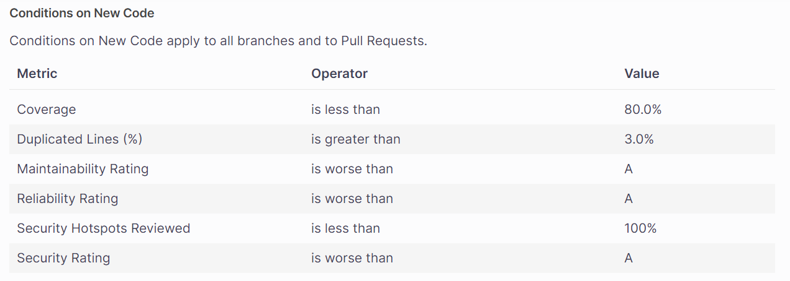

# Auteurs

Maxime BATTU

Batiste LALOI

# TP1 : Découverte de docker

## Mise en place de la base de données pgsql

```Dockerfile
FROM postgres:14.1-alpine

ENV POSTGRES_DB=db \
   POSTGRES_USER=usr \
   POSTGRES_PASSWORD=pwd

COPY dumps/ /docker-entrypoint-initdb.d/
```

> ### Tips : Why should we run the container with a flag -e to give the environment variables?
>Pour éviter de stocker les variables d'environnement dans l'image. Cela permet de ne pas les rendre publiques et de les rendre plus facilement modifiables.

> ### Tips : Why do we need a volume to be attached to our postgres container?
>Pour écrire dans une zone de stockage les données de la BDD. Cela permet de ne pas perdre les données en cas de redémarrage du container.

## 1-1 Document your database container essentials: commands and Dockerfile.

Network : `docker network create app-network`<br>
Admnier : `docker run -p 8090:8080 --net=app-network --name=adminer -d adminer` <br>
Lancement du postgres : `docker run -P --name [Nom de ton app] -d --net=app-network [USERNAME]/[Nom de ton app]`<br>
Persistance des données : `docker run -P --name [Nom de ton app] -d --net=app-network -v /my/own/datadir:/var/lib/postgresql/data [USERNAME]/[Nom de ton app]`

> ### Tips : Why do we need a reverse proxy ?
> Pour pouvoir faire du load balancing et de la répartition de charge. Cela permet de faire tourner plusieurs instances d'une même application et de les répartir entre elles.

## 1-2 Why do we need a multistage build? And explain each step of this dockerfile

Le multistage build permet de séparer les différentes étapes de la construction de l'image. Cela permet de ne pas avoir à installer des dépendances inutiles dans l'image finale. Par exemple, dans le cas d'un projet Java, on peut installer Maven dans l'image de build, puis copier le jar compilé dans l'image finale qui n'aura besoin que de Java pour fonctionner.

Dockerfile multistage :
```Dockerfile
# Build
FROM maven:3.8.6-amazoncorretto-17 AS myapp-build
# Création d'une variable d'environnement pour le chemin d'accès au dossier de l'app
ENV MYAPP_HOME /opt/myapp
# Définition du dossier de travail
WORKDIR $MYAPP_HOME
# Copie des fichiers de dépendances et de code source
COPY pom.xml .
COPY src ./src
# Compilation de l'app
RUN mvn package -DskipTests

# Run
FROM amazoncorretto:17
# Création d'une variable d'environnement pour le chemin d'accès au dossier de l'app
ENV MYAPP_HOME /opt/myapp
# Définition du dossier de travail
WORKDIR $MYAPP_HOME
# Copie du jar compilé depuis l'étape précédente (myapp-build)
COPY --from=myapp-build $MYAPP_HOME/target/*.jar $MYAPP_HOME/myapp.jar

# Lancement de l'app
ENTRYPOINT java -jar myapp.jar
```

> ### Tips : Why is docker-compose so important ?
>Il permet de définir les services à lancer et de les lier entre eux. Il est possible de définir des dépendances entre les services et de les lancer dans un ordre précis. Il est également possible de définir des variables d'environnement pour chaque service.

## 1-3 Document docker-compose most important commands.

Il y a plusieurs commandes importantes à utiliser lors de l'utilisation de docker-compose :

> Pour le lancement d'un docker compose :

- `docker compose build` : Permet de construire les images à à partir d'un fichier `docker-compose.yml` qui donne les emplacement de chaque Dockerfile pour chacun des services (API/DB/Web)
- `docker compose up` : Permet de lancer les services définis dans le fichier `docker-compose.yml` et de les lier entre eux. Il est possible de lancer les services en arrière plan avec l'option `-d`

> Autres commandes utiles

- `docker compose down` : Arrête et supprime tous les containers et volumes crées pour les services
- `docker compose ps` : Affiche l'état des services en cours
- `docker compose logs` : Affiche les logs du services

## 1-4 Document your docker-compose file.

```yaml
version: "3.7"

# Création des services
services:
  # Service backend | api
  backend:
    # Chemin vers le dockerfile
    build: /api/
    # Nom du container : api
    container_name: api
    # Réseau associé
    networks:
      - app-network
    # Dépendence du container : database
    depends_on:
      - database
  # Service database
  database:
    # Chemin vers le dockerfile
    build: /data/
    # Nom du container : database
    container_name: database
    # Réseau associé
    networks:
      - app-network
  # Service httpd
  httpd:
    # Chemin vers le dockerfile
    build: /http/
    # Nom du container : apache
    container_name: apache
    # Port exposé
    ports:
      - 80:80
    # Réseau associé
    networks:
      - app-network
    # Dépendence du container : backend
    depends_on:
      - backend

# Création du réseau
networks:
  app-network:
    # Configuration par défaut
    driver: bridge

```

## 1-5 Document your publication commands and published images in dockerhub.

Création des tags
- `docker tag docker-database maximebattu/docker-database:1.0`
- `docker tag docker-backend maximebattu/docker-api:1.0`
- `docker tag docker-httpd maximebattu/docker-web:1.0`

Push des images sur docker hub
- `docker push docker-database:1.0`
- `docker push docker-api:1.0`
- `docker push docker-web:1.0`

Images sur le [Docker Hub](https://hub.docker.com/u/maximebattu)

> ### Tips : Why do we put our images into an online repo ? (à compléter)
> Il est important de mettre ses images sur une répertoire en ligne, tel que Docker Hub pour tout simplement pouvoir réutiliser, partager ou récupérer des images fonctionnelles entre différents postes / personnes.
>
>Cela permete également de versionner différentes versions d'une images, avec l'évolution du technologie (passage de pgsql 14 à 15) et d'améliorer les performances d'installation. Ces images sont stockées sur différents serveurs très performants qui faciliteront le téléchargement des différentes images stockées.
>
> Cela peut s'avérer utile, si par exemple j'ai besoin d'une image docker pour une base de données postegres sql. Autant réutilisé une image déjà existante qui est déjà configurée et où le travail sera moindre.

___

# TP2 : Découverte Github Actions

> ### Note : What is it supposed to do?
> En lançant la commande `mvn clean verify`, nous rechargeons et installons toutes les dépendances décrites dans le `pom.xml`. En suite, les tests unitaires s'éxecutent un à un et la commande indique les réussites / échecs.


> ### Note : Unit tests ? Component tests ?
> Les Tests Unitaires sont des tests qui visent à vérifier le comportement d'une méthode ou d'une fonction. Ils sont généralement réalisé pour tester le développement d'une fonctionnalité et pour débugger et en gage de qualité de code.
>
>Les Tests de Composants sont des tests qui visent à vérifier le comportement d'une partie entière de l'application : classe ou module. Ces tests peuvent contenir différents Tests unitaires, car ils sont plus haut niveau. Ils sont généralement réalisé dans le cadre d'une modification de fonctionnalité sur l'applicatif pour éviter tout effet de bord et toutes régressions de l'application.

## 2-1 What are testcontainers ?

`Testcontainers` est une librairie java utilisée pour réalisé des tests sur une application : notamment des JUnit Tests. Elle permet la création d'une base de données directement lancée depuis un container avec un script donné (`ressources/InsertData.sql`) ce qui permet de simulée parfaitement la communication avec un module de base de données.

Voici toutes les dépendances utilisées pour la librairie `testcontainers` listées dans le `pom.xml`


## 2-2 Document your Github Actions configurations.

```yml
name: CI devops 2023
on:
  #to begin you want to launch this job in main and develop
  push:
    branches:
      - TP2
  pull_request:

jobs:
  test-backend:
    runs-on: ubuntu-22.04
    steps:
      #checkout your github code using actions/checkout@v2.5.0
      - uses: actions/checkout@v2.5.0

      #do the same with another action (actions/setup-java@v3) that enable to setup jdk 17
      - name: Set up JDK 17
        uses: actions/setup-java@v3
        with:
          java-version: 17
          distribution: corretto

      #finally build your app with the latest command
      - name: Build and test with Maven
        # Localisation du pom.xml
        run: mvn clean verify --file api/pom.xml
```

> ### Note : Secured Variables, why ?
> Pour ne pas perde ses identifiants et les avoir stockées à un seul endroit, ici Github, qui est sécurisé. De plus utiliser ces variables permettent le déploiement continu sans inclure des données sensibles (identifiant, mot de passe, token).

> ### Note : Why did we put needs: build-and-test-backend on this job? Maybe try without this and you will see !
> Sans ce job les tests unitaires décrit dans l'application ne s'executeront pas. Donc les pipelines perderaient de leurs sens car elles n'executeraient aucun tests.

> ### Note : For what purpose do we need to push docker images ?
> Pour plusieurs raisons :
>- Partage d'images
>- Versionnement
>- Automatisation de déploiement
>- Accessibilité
>- Gestion de la taille


## Document your quality gate configuration.


Notre sonar est configuré par défaut et il a des attentes très spécifiques sur les 6 analyses :



Bien sur cette configuration est celle présente par défaut et est donc contestable sur certains points, cela dépendra de notre applicatif et de ce que nous voulons réalisé avec (Autorisation des CORS ...)

> ### Tips : You can use on: workflow_run to trigger a workflow when another workflow is passed.
```yaml
name: CI
on:
  #to begin you want to launch this job in main and develop
  push:
    branches:
      - TP2
      - main
  pull_request:

jobs:
  test-backend:
    runs-on: ubuntu-22.04
    steps:
      #checkout your github code using actions/checkout@v2.5.0
      - uses: actions/checkout@v2.5.0

      #do the same with another action (actions/setup-java@v3) that enable to setup jdk 17
      - name: Set up JDK 17
        uses: actions/setup-java@v3
        with:
          java-version: 17
          distribution: corretto

      #finally build your app with the latest command
      - name: Build and test with Maven
        #run: mvn clean verify --file api/pom.xml
        run: mvn -B verify sonar:sonar -Dsonar.projectKey=MaximeBattu_DevOps -Dsonar.organization=maximebattu -Dsonar.host.url=https://sonarcloud.io -Dsonar.login=${{ secrets.SONAR_TOKEN }} --file ./api/pom.xml
```

```yaml
name: CD
on:
  #to begin you want to launch this job in main and develop
  workflow_run:
    workflows:
      - CI
    types:
      - completed
    branches:
      - main
  pull_request:

jobs:
  # define job to build and publish docker image
  build-and-push-docker-image:
    # run only when code is compiling and tests are passing
    runs-on: ubuntu-22.04

    # steps to perform in job
    steps:
      - name: Checkout code
        uses: actions/checkout@v2.5.0

      - name: Login to DockerHub
        run: docker login -u ${{ secrets.DOCKERHUB_USR }} -p ${{ secrets.DOCKERHUB_TOKEN }}

      - name: Build image and push backend
        uses: docker/build-push-action@v3
        with:
          # relative path to the place where source code with Dockerfile is located
          context: ./api/
          # Note: tags has to be all lower-case
          tags: ${{secrets.DOCKERHUB_USR}}/docker-api:latest
          # build on feature branches, push only on main branch
          push: ${{ github.ref == 'refs/heads/main' }}

      - name: Build image and push database
        uses: docker/build-push-action@v3
        with:
          # relative path to the place where source code with Dockerfile is located
          context: ./data/
          # Note: tags has to be all lower-case
          tags: ${{secrets.DOCKERHUB_USR}}/docker-database:latest
          # build on feature branches, push only on main branch
          push: ${{ github.ref == 'refs/heads/main' }}

      - name: Build image and push httpd
        uses: docker/build-push-action@v3
        with:
          # relative path to the place where source code with Dockerfile is located
          context: ./http/
          # Note: tags has to be all lower-case
          tags: ${{secrets.DOCKERHUB_USR}}/docker-web:latest
          # build on feature branches, push only on main branch
          push: ${{ github.ref == 'refs/heads/main' }}
```

___

# TP3  : Ansible

## Front

Nous avons rajouter un service dans le `docker-compose.yml`

```yml
version: '3.7'

services:
    api:
        build: /api/
        container_name: api
        ports:
          - 8081:8080
        networks:
          - app-network
        depends_on:
          - database

    database:
        build: /data/
        container_name: database
        networks:
          - app-network

    httpd:
        build: /http/
        container_name: apache
        ports:
          - 82:80
        networks:
          - app-network
        depends_on:
          - api
    
    front:
        build: /front/
        container_name: vue
        ports:
          - 80:80
        networks:
          - app-network
        depends_on:
          - httpd

networks:
    app-network:
      driver: bridge
```

Le nouveau service est `front` il dépend du bon lancement du service `httpd` et son lancement se fait sur le port 80.
Derière ce service nous avons une application Vue faisant des appels API vers le backend pour charger les données à afficher

>Voici quelques exemples du résultat obtenu


___

# TP Extra

> ### Objectif
> Mettre en place un loadbalancer sur les containers en place. Le but est de rajouter un nouveau container de "back" pour fluidifier le traffic entrant et ainsi le repartir équitablement vers les x containers à disposition

Pour mettre en place cette solution il faut modifier la configuration `httpd.conf`

```
<VirtualHost *:80>
    <Proxy balancer://my-java-api>
        BalancerMember "http://api1:8080"
        BalancerMember "http://api2:8080"
    </Proxy>

    ProxyPreserveHost On

    ProxyPass "/" "balancer://my-java-api/"
    ProxyPassReverse "/" "balancer://my-java-api/"
</VirtualHost>
```

Ici nous créons un nouveau `<Proxy balancer></Proxy>` avec x elements qui représente nos différent containers.

Nous devons aussi compléter le `docker-compose.yml`

```yml
version: '3.7'

services:
    backend-blue:
        build: /api/
        container_name: api1
        ports:
          - 8081:8080
        networks:
          - app-network
        depends_on:
          - database

    backend-green:
        build: /api/
        container_name: api2
        ports:
          - 8082:8080
        networks:
          - app-network
        depends_on:
          - database

    database:
        build: /data/
        container_name: database
        networks:
          - app-network

    httpd:
        build: /http/
        container_name: apache
        ports:
          - 82:80
        networks:
          - app-network
        depends_on:
          - backend-blue
          - backend-green
    
    front:
        build: /front/
        container_name: vue
        ports:
          - 80:80
        networks:
          - app-network
        depends_on:
          - httpd

networks:
    app-network:
      driver: bridge
```